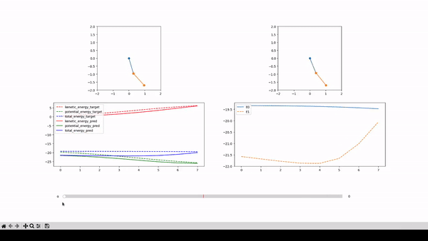
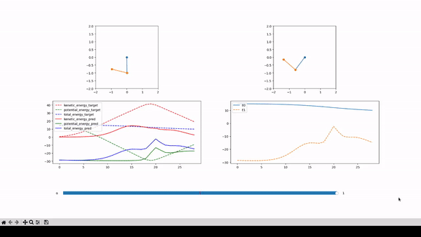
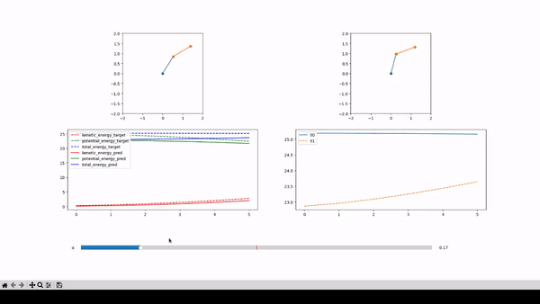

# rule-augmented-learning
My implementation of Controlling Neural Networks with Rule Representations ArXiv:2106.07804

alpha is 0. This means that it only tries to follow the original pendulum on the right.  
E1 can be below or above E0 as it's unconstrained.  

alpha is 1. This means that it only tries to constrain E1 to be below E0.  

alpha is 0.17. This is a balance between only following the pendulum and trying to get E1 to be below E0.
